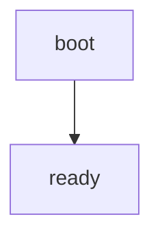

This page declares `math: true`, so the MathJax runtime ships with it: the
cost is $2^N$ per node and \[T = N \log N\] overall.

```mermaid
graph TD
  A[boot] --> B[ready]
```

Continue on [the first page](first.md#target-section).
